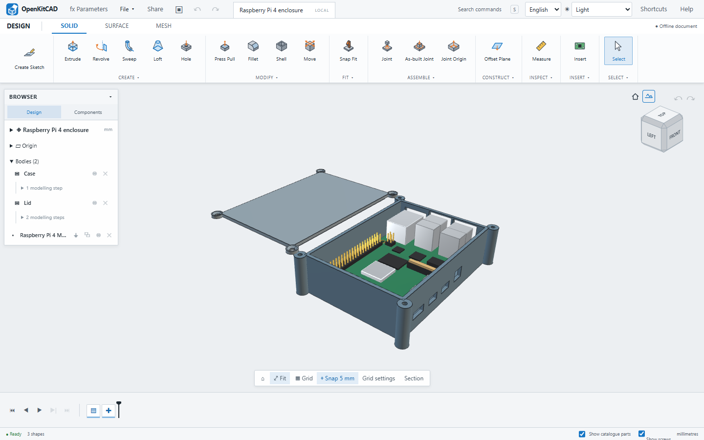
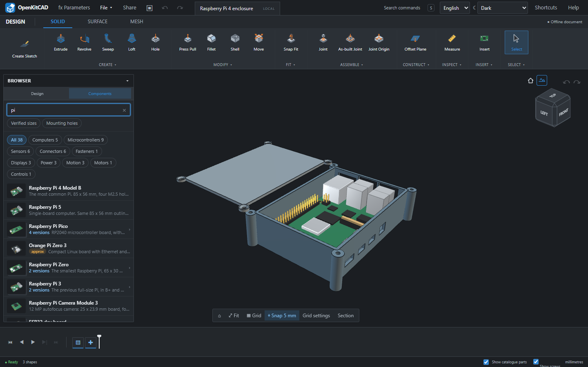
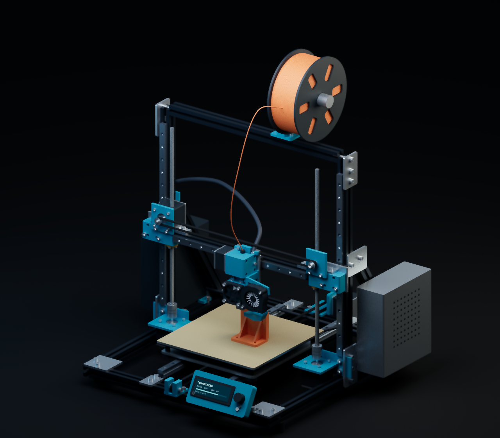

# OpenKitCAD

CAD for the stuff on your workbench: enclosures, mounting plates, brackets, and the boards that go inside them.

[](https://github.com/Broiler747tb/openkitcad/actions/workflows/deploy.yml) [](https://github.com/Broiler747tb/openkitcad/releases/latest) [](LICENSE) [](src/catalogue/parts)

**[Open in your browser](https://broiler747tb.github.io/openkitcad/)** · **[Windows Portable EXE](https://github.com/Broiler747tb/openkitcad/releases/latest)** · [Report a bug](https://github.com/Broiler747tb/openkitcad/issues)

Drop in a Raspberry Pi, build a case around it, and export something you can print. The catalogue already has the board size, mounting holes, and ports, so you don't have to type them in again.

<picture>
  <source media="(prefers-color-scheme: dark)" srcset="docs/images/enclosure-dark.png">
  
</picture>

*A Pi 4 case with standoffs and port openings. [Download this design](examples/raspberry-pi-enclosure.okc?raw=true) and open it with File → Open.*

## From board to box

1. Pick a board from **Components** and place it.
2. Right-click it and choose **Enclosure**.
3. Set the wall thickness, mounts, lid, and ports you want open.
4. Export STL or 3MF and send it to your slicer.

You can also sketch a part from scratch. Give it dimensions, extrude it, then go back and change those dimensions when the first print doesn't fit.

## What's in here

| Toolbox | What's there |
| --- | --- |
| Sketches | Dimensions, constraints, trim, offsets, patterns, and text. |
| Modelling | Extrude, revolve, loft, sweep, fillet, shell, booleans, and an editable timeline. |
| Real parts | 174 boards, connectors, motors, bearings, screws, and inserts. Import your own KiCad board too. |
| Printed parts | Standoffs, board clips, snap fits, hinges, ribs, and cable entries. |
| Assemblies | Linked components, joints, limits, and motion studies. |
| Export | STL, 3MF, OBJ, STEP, DXF, SVG, and printable drill templates. |

<details>
<summary>A look at the parts drawer</summary>



Parts are marked **datasheet**, **measured**, or **approximate**. Their source notes say which dimensions were checked.

</details>

<details>
<summary>The printer from the cover</summary>



[Open this assembly](examples/cartesian-printer.okc?raw=true) with File → Open.
It includes the frame, drives, hotend, cooling ducts, wiring and electronics.
The `.okc` contains mesh bodies; [the generator](scripts/showcase) also exports solid STEP geometry.

</details>

## Your files

Designs stay on your machine. Autosave uses the browser's storage; **Save** gives you an `.okc` file you can keep or move to another computer.

**Share** packs a snapshot into a link. Open it to look around in 3D, download the `.okc`, or edit your own copy. No account, uploads, or model server. Bigger models may need a file instead — a link can't hold everything. [How sharing works](docs/SHARING.md).

The browser version loads about 11 MB for the geometry engine on first use. The Windows EXE includes it and runs offline.

## Run it locally

Node.js **22.12 or newer**.

```sh
npm ci
npm run dev
```

<details>
<summary>Builds, tests, and the code</summary>

```sh
npm run typecheck
npm run format:check
npx playwright install chromium
npm test
npm run dist:portable   # Windows x64
```

`npm test` checks the solver, geometry, saving, editing, and sharing, including browser UI scenarios. You can also [run the checks in your browser](https://broiler747tb.github.io/openkitcad/?selftest).

The app uses React, TypeScript, and three.js. [replicad](https://github.com/sgenoud/replicad) wraps OpenCascade, which runs in a worker. The sketch solver lives in [src/sketch](src/sketch), hardware data in [src/catalogue](src/catalogue).

[Architecture notes](docs/FOUNDATIONS.md) · [Android / S Pen build](docs/ANDROID.md)

</details>

## Add a part

A caliper helps more than a fancy model. Add a JSON file to [src/catalogue/parts](src/catalogue/parts); [the schema](src/catalogue/types.ts) and [this bearing](src/catalogue/parts/bearing-608zz.json) are a good starting point.

Use millimetres, put the origin at the lower-left corner with Z up, and say where the measurements came from. Guesses are fine if they're labelled as guesses.

## Still missing

Sheet metal, drawing sheets, simulation, and CAM. Some direct face-editing tools aren't available in the bundled kernel. Files from OpenKitCAD 0.6 and older won't open in this version.

## Licence and support

The app is [AGPL-3.0-or-later](LICENSE). The [parts catalogue is CC0](src/catalogue/LICENSE), so other tools can use the measurements too.

If this saved you an afternoon, you can chip in for filament.

<details>
<summary>Donation addresses</summary>

| Network | Address |
| --- | --- |
| TON | `UQBZwupG-6KNVW9gpBUWfD-yTcBj2x9TnlP_xBbje_qblyaO` |
| Ethereum | `0x813EB4EaC25e28d60C21af26E432b98E13D79980` |
| Solana | `3LbwCtvxRQqQEmQk44byY3wpYsnZUf832jwoCZRrg3dh` |

</details>
