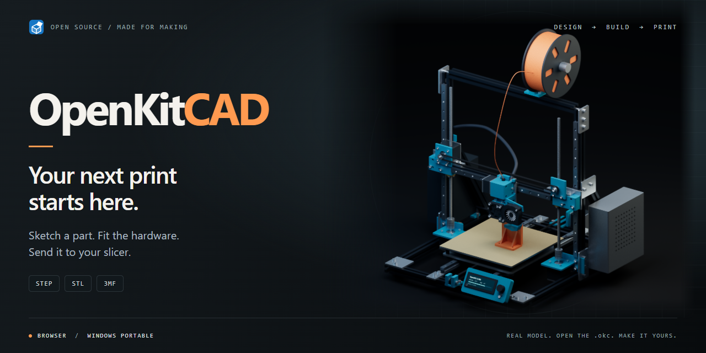

<p align="center">
  
</p>

<p align="center">
  <strong><a href="https://broiler747tb.github.io/openkitcad/">Open in your browser ↗</a></strong>
  &nbsp; · &nbsp;
  <strong><a href="https://github.com/Broiler747tb/openkitcad/releases/latest">Download for Windows ↓</a></strong>
  &nbsp; · &nbsp;
  <a href="https://github.com/Broiler747tb/openkitcad/issues">Found a bug?</a>
</p>

<p align="center">
  <a href="https://github.com/Broiler747tb/openkitcad/actions/workflows/deploy.yml"></a>
  <a href="https://github.com/Broiler747tb/openkitcad/releases/latest"></a>
  <a href="LICENSE"></a>
</p>

CAD for the stuff on your workbench. A case for your board, a bracket that actually fits, a replacement for the bit that snapped.

Start with a sketch or pick real hardware from the parts drawer. Model around it, check the fit, export to your slicer. Runs in the browser; the Windows portable also works offline. English and Russian included.

## From board to box

<picture>
  <source media="(prefers-color-scheme: dark)" srcset="docs/images/enclosure-dark.png">
  
</picture>

*A Pi 4, its case, and a lid moved aside. [Try this design →](examples/raspberry-pi-enclosure.okc?raw=true)*

| 01 · Pick the hardware | 02 · Make it fit | 03 · Print it |
| --- | --- | --- |
| Choose a board in **Components**. Sizes, ports, and mounting holes are already there. | Right-click → **Enclosure**. Set walls, mounts, and lid. Or sketch your own part. | Export **STL** or **3MF**. Change a dimension after the first test print. |

## A proper toolbox

| Tool | What it does |
| --- | --- |
| **Sketch & model** | Dimensions and constraints. Extrude, revolve, loft, sweep, fillet, shell, and booleans. Go back and edit the timeline. |
| **Build around real parts** | 257 boards, connectors, motors, bearings, screws, and inserts. Bring your own board from KiCad. |
| **Make the small stuff** | Standoffs, clips, snap fits, hinges, ribs, and cable entries. Fit allowances and checks for your nozzle and bed. |
| **Put it together** | Linked components, joints, limits, and motion studies. Export several bodies with their positions intact. |
| **Take it elsewhere** | STEP, STL, 3MF, OBJ, DXF, SVG, and printable drill templates. |

<details>
<summary><strong>Inside the parts drawer</strong></summary>


Parts say **datasheet**, **measured**, or **approximate**. Source notes tell you which dimensions were checked. A pretty model isn't a measurement.

</details>

<details>
<summary><strong>Yes, you can open the printer from the cover</strong></summary>


[Download the assembly →](examples/cartesian-printer.okc?raw=true) Then **File → Open**.

This example contains imported mesh bodies. Want the solid STEP too? [The model generator is here](scripts/showcase).

</details>

## Your design stays yours

Autosave stays in your browser. **Save** gives you an `.okc` file.

**Share** puts a snapshot in a link: someone else can rotate it, download it, or edit a copy. No account or model server. Big assemblies are better sent as files. [How it works →](docs/SHARING.md)

The browser downloads about 11 MB for the geometry engine on first use. The portable EXE includes it.

<details>
<summary><strong>Run locally / work on the code</strong></summary>

Node.js **22.12+**.

```sh
npm ci
npm run dev
```

```sh
npm run typecheck
npm run format:check
npx playwright install chromium
npm test
npm run dist:portable   # Windows x64
```

React, TypeScript, three.js, and [replicad](https://github.com/sgenoud/replicad) / OpenCascade in a worker. Tests cover geometry, the solver, saving, editing, sharing, and browser interactions. [Run the checks in your browser](https://broiler747tb.github.io/openkitcad/?selftest).

[Architecture](docs/FOUNDATIONS.md) · [Sketch solver](src/sketch) · [Catalogue](src/catalogue) · [Android / S Pen](docs/ANDROID.md)

</details>

<details>
<summary><strong>Add a part to the catalogue</strong></summary>

A caliper helps more than a fancy model. Add a JSON file to [src/catalogue/parts](src/catalogue/parts); [the schema](src/catalogue/types.ts) and [this bearing](src/catalogue/parts/bearing-608zz.json) are good starting points.

Use millimetres, put the origin at the lower-left corner with Z up, and say where the measurements came from. Guesses are fine if they're labelled.

</details>

<details>
<summary><strong>What's still missing</strong></summary>

Sheet metal, drawing sheets, simulation, and CAM. Some direct face-editing tools aren't supported by the bundled kernel. Files from version 0.6 and older won't open.

</details>

---

The app is [AGPL-3.0-or-later](LICENSE). The [parts catalogue is CC0](src/catalogue/LICENSE) — use those measurements in your own tools too.

If this saved you an afternoon, you can chip in for filament.

<details>
<summary>Donation addresses</summary>

| Network | Address |
| --- | --- |
| TON | `UQBZwupG-6KNVW9gpBUWfD-yTcBj2x9TnlP_xBbje_qblyaO` |
| Ethereum | `0x813EB4EaC25e28d60C21af26E432b98E13D79980` |
| Solana | `3LbwCtvxRQqQEmQk44byY3wpYsnZUf832jwoCZRrg3dh` |

</details>
